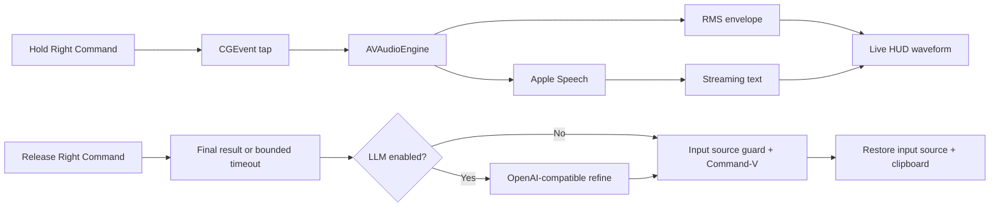

<div align="center">
  

  

  <h1>VoiceInput</h1>
  <p><strong>按住右 Command 说话，松手，文字落在光标所在的位置。</strong></p>
  <p>一款原生、克制、专注于中文体验的 macOS 菜单栏语音输入工具。</p>
  <p><sub><a href="README_EN.md">English</a></sub></p>

  <p>
    
    
    
    
    <a href="https://github.com/xingbofeng/VoiceInput/releases/latest"></a>
  </p>
  <p>
    🌐 <a href="https://xingbofeng.github.io/VoiceInput/">官方网站</a>
    &nbsp;·&nbsp;
    🎬 <a href="docs/voiceinput-demo-land.mp4">介绍视频</a>
  </p>
</div>

## Why VoiceInput

vibe coding 之后，写代码这件事变了。

以前更多是在键盘上敲代码，现在很多时候是在描述意图、补充上下文、解释问题、让 Agent 调整方向。这些话用嘴说很自然，但一字一句打出来就很慢。

我试过一些现有产品，它们各自都有做得不错的地方。但用下来发现，我真正想要的其实更简单——一个"语音键盘"，而不是语音助手。

VoiceInput 想解决的，就是这件小事。

**它只做三件事：**

- **够轻。** 按住右 Command 说话，松手后文字直接出现在光标位置。不抢当前窗口焦点，不打断正在写东西的流程，不强迫你进入复杂配置。
- **技术词尽量准。** 内置可选 LLM 纠错，只修正明显听错的技术词——"配森"修成 Python，"杰森"修成 JSON，"Type Script"修成 TypeScript。不润色、不改写、不替用户做决定。
- **不打断思路。** 当写代码越来越像是在和 AI 描述想法时，输入方式也应该变得更自然一点。

VoiceInput 不是一个大产品，也不想替代所有语音输入工具。它只是我自己在 vibe coding 里想要的一个输入层。

## Highlights

| 能力 | 实现 |
| --- | --- |
| 即按即说 | CGEvent tap 只监听并抑制右 Command，左 Command 保持原有行为 |
| 中文开箱即用 | 默认 `zh-CN`，支持英语、简中、繁中、日语、韩语 |
| 实时转录 | Apple Speech Recognition 流式 partial result |
| 有生命的波形 | 真实麦克风 RMS 驱动，带 attack/release 包络和轻微随机抖动 |
| 无打扰 HUD | `NSPanel` + `.hudWindow`，不抢焦点，不打断当前应用 |
| 稳定注入 | CJK 输入法临时切到 ABC/US，Command-V 后恢复输入源 |
| 完整剪贴板恢复 | 保存并恢复全部 pasteboard items 与类型，不只纯文本 |
| 可选 LLM 纠错 | 支持 OpenAI-compatible API，专治中英文技术术语误识别 |
| 多引擎切换 | 可插拔 ASR 引擎架构，内置 Apple Speech 与 Qwen3-ASR 双引擎 |
| 快捷键自定义 | 支持录制任意快捷键、调节长按阈值、配置短按行为 |
| 设置面板 | ASR / LLM / 快捷键三栏分页设置 |
| 纯菜单栏运行 | `LSUIElement`，无 Dock 图标 |

## Quick Start

### 下载安装

从 [GitHub Releases](https://github.com/xingbofeng/VoiceInput/releases/latest) 下载 `VoiceInput-1.0.0-macOS.dmg`：

1. 打开 DMG 文件
2. 将 `VoiceInputApp` 拖入 `Applications` 文件夹
3. 首次启动：**按住 Control 键点击应用** → 选择 **"打开"**（见下方说明）

### Requirements

- macOS 14 Sonoma 或更高版本
- 带左右 Command 键的 Mac 键盘

### 从源码构建

```bash
git clone https://github.com/xingbofeng/VoiceInput.git
cd VoiceInput
make run
```

Release 构建为 Universal Binary，同时支持 Apple Silicon 与 Intel Mac。

安装到 `/Applications`：

```bash
make install
open /Applications/VoiceInputApp.app
```

默认使用 ad-hoc 签名。需要使用开发者证书时：

```bash
make CODE_SIGN_IDENTITY="Developer ID Application: Your Name (TEAMID)" build
```

## First Launch

### 权限

VoiceInput 需要三项系统权限：

| 权限 | 用途 | 路径 |
| --- | --- | --- |
| 辅助功能 | 全局监听右 Command、模拟 Command-V | 系统设置 -> 隐私与安全性 -> 辅助功能 |
| 麦克风 | 捕获实时音频 | 系统设置 -> 隐私与安全性 -> 麦克风 |
| 语音识别 | 使用 Apple Speech 转录 | 系统设置 -> 隐私与安全性 -> 语音识别 |

授权后若右 Command 没有响应，请退出并重新打开 VoiceInput。菜单栏中应出现麦克风图标。

### Gatekeeper 提醒

当前采用 ad-hoc 签名（未公证），macOS 首次打开时会提示 **"无法验证是否包含恶意软件"**。这是正常现象，VoiceInput 不开源不可信。

绕过方法（任选其一）：

**方法一**：在 Finder 中 **按住 Control 键点击应用** → 选择 **"打开"** → 在弹出的对话框中再次点击 **"打开"**。

**方法二**：打开终端执行：

```bash
sudo xattr -cr /Applications/VoiceInputApp.app
```

执行后正常双击打开即可。

## Usage

### Dictation

1. 将光标放入任意可编辑输入框。
2. 按住右侧 `Command`，看到屏幕底部出现胶囊。
3. 说话。胶囊会实时显示识别结果，波形会跟随音量变化。
4. 松开右侧 `Command`。最终文字会自动粘贴到当前输入框。

### Language

打开菜单栏图标 -> `语言 / Language`：

- English (`en-US`)
- 简体中文 (`zh-CN`，默认)
- 繁體中文 (`zh-TW`)
- 日本語 (`ja-JP`)
- 한국어 (`ko-KR`)

选择会持久化到 `UserDefaults`。

### ASR 引擎

VoiceInput 支持可插拔的语音识别引擎，可在菜单栏 `语音识别引擎` 子菜单中切换：

| 引擎 | 说明 |
| --- | --- |
| Apple Speech | 系统内置，开箱即用，需要语音识别权限 |
| Qwen3-ASR | 实验性引擎，仅需麦克风权限（开发中） |

Qwen3-ASR 默认不可切换。打开菜单栏图标 → `设置...` → `ASR`，点击 `下载模型...` 后，VoiceInput 会在设置页显示下载进度，并把模型保存到本机 Application Support 目录；下载完成后才能切换到 Qwen3-ASR。选择 Qwen3-ASR 时，系统不会请求 Apple 语音识别权限。

### 快捷键设置

打开菜单栏图标 → `设置...` → `快捷键`，可以：

- **录制快捷键**：点击"录制"按钮后按下想设置的键（支持修饰键和普通键）
- **长按阈值**：调节长按与短按的区分时间（默认 500ms）
- **短按行为**：短按时可选择"无操作"或"切换持续监听"

设置即时生效，无需重启应用。

## LLM Refinement

Apple Speech 已经很快，但中英文混说时，技术词汇仍可能变成谐音字。VoiceInput 可以在粘贴前调用 OpenAI-compatible API 做一次极保守的纠错：

```text
配森  -> Python
杰森  -> JSON
```

它不会润色、改写或压缩内容。模型不确定时，system prompt 要求原样返回。

打开菜单栏图标 → `设置...` → `LLM`，填写：

| 字段 | 示例 |
| --- | --- |
| API Base URL | `https://tokenhub.tencentmaas.com/v1` |
| API Key | 你的服务密钥 |
| Model | `deepseek-v4-flash-202605` |

Base URL 同时兼容以下形式，不会重复拼接 `/v1`：

```text
https://api.example.com
https://api.example.com/v1
https://api.example.com/v1/chat/completions
```

点击 `Test` 验证连接，点击 `Save` 保存。随后在菜单栏图标中开启 `LLM 纠错`。录音结束后，HUD 会显示 `Refining...`，模型返回后再注入文字；网络失败时自动回退到原始转录。

> 当前 API Key 保存在本机 `UserDefaults` 中，未写入仓库，但也未使用 Keychain 加密。请只在受信任的 Mac 用户账户中配置。

## How It Works



### Module Map

```text
AppDelegate
├── KeyMonitor                 Right Command event tap and suppression
├── AudioRecorder              AVAudioEngine capture and RMS
├── ASRManager                 ASR engine selection and factory
│   ├── ASREngine              Pluggable engine protocol
│   ├── SpeechRecognizer       Apple Speech implementation
│   ├── Qwen3ASREngine         Qwen3-ASR implementation
│   └── AudioPreprocessor      Fbank feature extraction (Accelerate)
├── ShortcutManager            Hotkey config, threshold, short-press behavior
├── SettingsWindowController   Tabbed settings UI (ASR / LLM / Shortcut)
├── OverlayWindowController    Non-activating capsule HUD
├── TextInjector               Input source, paste, clipboard restore
├── LLMRefiner                 OpenAI-compatible conservative correction
└── LanguageManager            Locale selection and persistence
```

## Privacy

VoiceInput does not include analytics or telemetry.

- Audio is captured locally by `AVAudioEngine`.
- Speech recognition currently sets `requiresOnDeviceRecognition = false`; Apple Speech may process audio over the network.
- LLM refinement is disabled unless you enable and configure it.
- When LLM refinement is enabled, only the recognized text is sent to your configured API endpoint.
- Clipboard content is held in memory only for the duration of text injection, then restored.

## Development

```bash
make build      # Release app bundle + signature verification
make run        # Build and launch one instance
make install    # Install to /Applications
make release    # Signed app bundle + zip + SHA-256
make debug      # Strict debug compilation
make clean      # Remove SwiftPM products and app bundle
swift test      # Unit test suite
```

运行真实 LLM 集成测试：

```bash
VOICEINPUT_TEST_BASE_URL="https://api.example.com/v1" \
VOICEINPUT_TEST_API_KEY="your-key" \
VOICEINPUT_TEST_MODEL="your-model" \
swift test --filter LLMRefinerTests/testConfiguredOpenAICompatibleServiceRefinesMixedLanguageText
```

测试覆盖语言默认值、LLM URL 归一化与响应解析、完整剪贴板快照、右 Command 状态转换、CJK 输入源判断、RMS、波形包络、HUD 尺寸和转录收尾竞态。

## Troubleshooting

| 症状 | 检查 |
| --- | --- |
| 按右 Command 没反应 | 确认辅助功能权限，退出后重开应用 |
| 左 Command 被影响 | 确认运行的是最新安装版本，且没有两个 VoiceInput 进程 |
| 胶囊出现但没有文字 | 检查麦克风、语音识别权限和网络 |
| 中文输入法吞掉粘贴 | 确保系统中存在 ABC 或 US 键盘布局 |
| Test 返回 404 | Base URL 可填 API 根路径或 `/v1`，不要填写其他业务页面 |
| LLM 超时 | VoiceInput 会回退到原始识别文本，不会丢失本次输入 |
| 修改权限后仍无效 | `pkill -x VoiceInputApp` 后重新打开应用 |

查看应用是否只运行一个实例：

```bash
pgrep -alf VoiceInputApp
```

## Design Principles

- 输入优先：任何 UI 都不能抢走当前文本框焦点。
- 保守优先：LLM 只能修明显错误，不能替用户重写。
- 状态可恢复：输入法和剪贴板必须在注入后回到原状。
- 证据优先：构建、测试、签名和真实 API 分开验证，不用”能编译”代替”能工作”。

## 思想来源

本项目灵感来源于 [yetone/voice-input-src](https://github.com/yetone/voice-input-src)，感谢他们的开创性工作。
