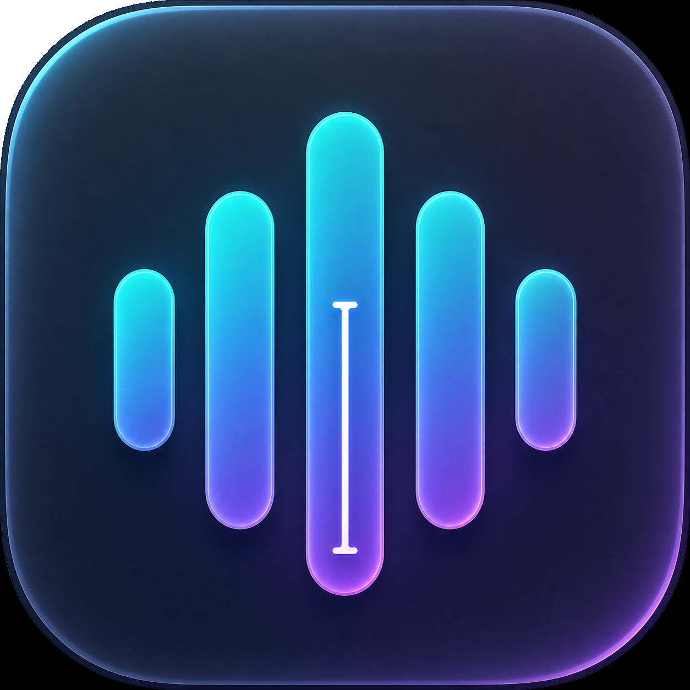
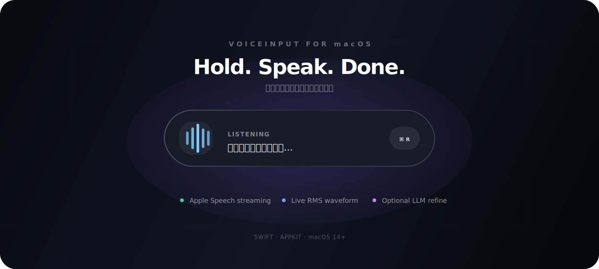
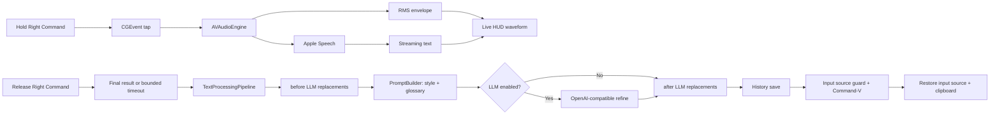

<div align="center">
  

  

  <h1>VoiceInput</h1>
  <p><strong>Hold Right Command, speak, release — text appears where your cursor is.</strong></p>
  <p>A native, restrained, Chinese-first macOS menu-bar voice input tool.</p>
  <p><sub><a href="README.md">中文</a></sub></p>

  <p>
    
    
    
    
    <a href="https://github.com/xingbofeng/VoiceInput/releases/latest"></a>
  </p>
  <p>
    🌐 <a href="https://xingbofeng.github.io/VoiceInput/">Website</a>
    &nbsp;·&nbsp;
    🎬 <a href="docs/voiceinput-demo-land.mp4">Intro Video</a>
  </p>
</div>

## Why VoiceInput

After vibe coding, writing code is no longer the same.

It used to be mostly about typing. Now it's about describing intent, providing context, explaining problems, and steering agents. Speaking these things comes naturally — but typing them out, word by word, is slow.

I tried existing tools. Some are feature-rich, some are smart, some support local or cloud models. But what I actually wanted was simpler: a "voice keyboard," not a voice assistant.

VoiceInput is my answer to that small problem.

**It does exactly three things:**

- **Stays light.** Hold Right Command, speak, release — text appears right where your cursor is. It never steals focus, never interrupts your flow, and never forces you into complex configuration.
- **Gets technical terms right.** Optional LLM refinement fixes only obvious misrecognitions — "配森" → Python, "杰森" → JSON, "Type Script" → TypeScript. No polishing, no rewriting, no second-guessing the user.
- **Keeps you in flow.** When writing code feels more and more like describing ideas to an AI, the input method should feel just as natural.

VoiceInput is not a big product, and it's not trying to replace every voice input tool out there. It's just the input layer I wanted for my own vibe coding workflow.

## Highlights

| Capability | Implementation |
| --- | --- |
| Push-to-talk | CGEvent tap listens only to and suppresses Right Command; Left Command stays native |
| Chinese out of the box | Default `zh-CN`, with English, Simplified Chinese, Traditional Chinese, Japanese, Korean |
| Real-time transcription | Apple Speech Recognition streaming partial results |
| Living waveform | Real microphone RMS driven, with attack/release envelope and subtle random jitter |
| Non-intrusive HUD | `NSPanel` + `.hudWindow`, never steals focus or interrupts your current app |
| Reliable injection | CJK input methods temporarily switched to ABC/US, Command-V pasted, then restored |
| Full clipboard restore | Saves and restores all pasteboard items and types, not just plain text |
| Optional LLM refinement | Supports OpenAI-compatible API, targeting Chinese-English technical term misrecognitions |
| Multi-engine switching | Pluggable ASR architecture with Apple Speech and Qwen3-ASR |
| Workbench | Home, glossary, styles, file transcription, notes, dictation models, settings, help |
| Glossary and replacements | Terms, aliases, JSON/CSV import/export, before/after LLM replacement rules |
| Style system | Original, formal, casual, energetic, coding, email styles, plus app-based auto selection |
| File transcription | Audio/video queue, progress, cancel, retry, txt/md/srt export, save as note |
| Notes | Markdown drafts, search, tags, save from history or file transcription |
| Customizable shortcuts | Record any key, adjust long-press threshold, configure short-press behavior |
| Settings center | General, system, data and privacy settings, including import/export and reset |
| Regular macOS app + menu-bar controls | Managed through Dock, `Command+Tab`, and Force Quit while keeping the menu-bar dictation entry |

## Quick Start

### Download & Install

Download `VoiceInput-1.1.0-macOS.dmg` from [GitHub Releases](https://github.com/xingbofeng/VoiceInput/releases/latest):

1. Open the DMG file
2. Drag `VoiceInputApp` into the `Applications` folder
3. First launch: **Control-click the app** → select **"Open"** (see below)

### Requirements

- macOS 14 Sonoma or later
- A Mac keyboard with left and right Command keys

### Build From Source

```bash
git clone https://github.com/xingbofeng/VoiceInput.git
cd VoiceInput
make run
```

Release builds are Universal Binaries supporting both Apple Silicon and Intel Macs.

Install to `/Applications`:

```bash
make install
open /Applications/VoiceInputApp.app
```

Ad-hoc signing is the default. To use a Developer ID certificate:

```bash
make CODE_SIGN_IDENTITY="Developer ID Application: Your Name (TEAMID)" build
```

## First Launch

### Permissions

VoiceInput requires three system permissions:

| Permission | Purpose | Path |
| --- | --- | --- |
| Accessibility | Global Right Command monitoring, simulated Command-V | System Settings → Privacy & Security → Accessibility |
| Microphone | Capture live audio | System Settings → Privacy & Security → Microphone |
| Speech Recognition | Apple Speech transcription | System Settings → Privacy & Security → Speech Recognition |

If Right Command doesn't respond after granting permissions, quit and reopen VoiceInput. A microphone icon should appear in your menu bar.

### Gatekeeper Warning

VoiceInput is ad-hoc signed (not notarized). On first launch, macOS will show **"Apple cannot verify that this app is free from malware"**. This is normal — VoiceInput is fully open source.

To bypass (choose one):

**Method 1**: In Finder, **Control-click the app** → select **"Open"** → click **"Open"** in the dialog.

**Method 2**: Run in Terminal:

```bash
sudo xattr -cr /Applications/VoiceInputApp.app
```

After doing either once, the app will launch normally on subsequent opens.

## Usage

### Dictation

1. Place your cursor in any editable text field.
2. Hold Right `Command` — the capsule appears at the bottom of the screen.
3. Speak. The capsule shows recognition results in real time, and the waveform responds to your voice volume.
4. Release Right `Command`. The final text is automatically pasted into the current text field.

### Language

Open the menu bar icon → `语言 / Language`:

- English (`en-US`)
- 简体中文 (`zh-CN`, default)
- 繁體中文 (`zh-TW`)
- 日本語 (`ja-JP`)
- 한국어 (`ko-KR`)

Your selection is persisted in `UserDefaults`.

### ASR Engine

VoiceInput supports pluggable speech recognition engines. Switch from the menu bar `ASR Engine` submenu, or use the workbench `Dictation Models` page to inspect capability tags, default model, and fallback behavior:

| Engine | Description |
| --- | --- |
| Apple Speech | Built-in, works out of the box, requires Speech Recognition permission |
| Qwen3-ASR | Experimental engine, only requires Microphone permission (in development) |

Qwen3-ASR cannot be selected until a local model is configured. Open the workbench → `Dictation Models` and download the local model; VoiceInput shows download progress and saves the model under the local Application Support directory. Qwen3-ASR becomes selectable after the download completes. When Qwen3-ASR is selected, Apple Speech Recognition permission is not requested.

### Shortcut Settings

Open the menu bar icon → `设置...` → `快捷键` to:

- **Record shortcut**: Click "Record" and press any key (supports modifier keys and regular keys)
- **Long-press threshold**: Adjust the duration that distinguishes short press from long press (default 500ms)
- **Short-press behavior**: Choose "No action" or "Toggle continuous listening" on short press

Changes take effect immediately — no restart required.

## Workbench

Open the menu bar icon → `打开工作台...` to use the full workbench:

| Page | Purpose |
| --- | --- |
| Home | Stats, goal progress, history details, copy, delete, reprocess |
| Glossary | Terms, aliases, replacement rules, JSON/CSV import and export |
| Styles | Prompt editing, default style, app rules, and automatic selection through the global model |
| File Transcription | Drag audio/video files, queue transcription, export txt/md/srt, save as note |
| Notes | Markdown editing, search, tags, export |
| Settings | Unified OpenAI-compatible and dictation models, input devices, shortcuts, permissions, privacy, and data |
| Help | Version, permission hints, project links |

## LLM Refinement

Apple Speech is fast, but technical terms in mixed Chinese-English speech can still become phonetic homophones. VoiceInput can run a single, extremely conservative correction pass through an OpenAI-compatible API before pasting:

```text
配森  → Python
杰森  → JSON
```

It will never polish, rewrite, or compress your content. When the model is uncertain, the system prompt instructs it to return the input unchanged.

Open the workbench → `LLM Provider`, or use the legacy settings entry, and fill in:

| Field | Example |
| --- | --- |
| API Base URL | `https://tokenhub.tencentmaas.com/v1` |
| API Key | Your service key |
| Model | `deepseek-v4-flash-202605` |

The Base URL handles the following forms without duplicating `/v1`:

```text
https://api.example.com
https://api.example.com/v1
https://api.example.com/v1/chat/completions
```

Click test connection to verify the service, and refresh models to record available models and latency. API keys are stored only in macOS Keychain; plaintext keys written to `UserDefaults` by older builds are migrated and removed when configuration loads. Enable refinement from the menu bar `LLM 纠错` item. After recording, the HUD shows `Refining...`; once the model returns, the corrected text is injected. On network failure, it falls back to the raw transcription automatically.

## How It Works



### Module Map

```text
AppDelegate
├── KeyMonitor                 Right Command event tap and suppression
├── AudioRecorder              AVAudioEngine capture and RMS
├── ASRManager                 ASR engine selection and factory
│   ├── ASREngine              Pluggable engine protocol
│   ├── SpeechRecognizer       Apple Speech implementation
│   ├── Qwen3ASREngine         Qwen3-ASR implementation
│   └── AudioPreprocessor      Fbank feature extraction (Accelerate)
├── DictationOrchestrator      ASR final/partial fallback, pipeline, injection, history
├── TextProcessingPipeline     Replacement rules, PromptBuilder, conservative LLM fallback
├── WindowCoordinator          Workbench window lifecycle
├── MainShellView              SwiftUI workbench navigation
├── ShortcutManager            Hotkey config, threshold, short-press behavior
├── OverlayWindowController    Non-activating capsule HUD
├── TextInjector               Input source, paste, clipboard restore
├── LLMRefiner                 OpenAI-compatible conservative correction
├── Repositories               SQLite history/glossary/style/provider/jobs/notes/settings
├── KeychainCredentialStore    API key persistence
└── LanguageManager            Locale selection and persistence
```

## Privacy

VoiceInput does not include analytics or telemetry.

- Audio is captured locally by `AVAudioEngine`.
- Speech recognition provider is user-selectable. Apple Speech may process audio over the network; local Qwen3-ASR runs on-device after the model is downloaded.
- LLM refinement is disabled unless you enable and configure it.
- When LLM refinement is enabled, only the recognized text is sent to your configured API endpoint.
- Glossary, history, jobs, notes and non-secret settings live in local SQLite. API keys live in Keychain.
- Clipboard content is held in memory only for the duration of text injection, then restored.

## Development

```bash
make build      # Release app bundle + signature verification
make run        # Build and launch one instance
make install    # Install to /Applications
make release    # Signed app bundle + zip + SHA-256
make debug      # Strict debug compilation
make clean      # Remove SwiftPM products and app bundle
swift test      # Unit test suite
```

To run the live LLM integration test:

```bash
VOICEINPUT_TEST_BASE_URL="https://api.example.com/v1" \
VOICEINPUT_TEST_API_KEY="your-key" \
VOICEINPUT_TEST_MODEL="your-model" \
swift test --filter LLMRefinerTests/testConfiguredOpenAICompatibleServiceRefinesMixedLanguageText
```

Tests cover language defaults, LLM URL normalization and response parsing, full clipboard snapshots, Right Command state transitions, CJK input source classification, RMS, waveform envelopes, HUD sizing, and transcription completion races.

## Troubleshooting

| Symptom | Check |
| --- | --- |
| Right Command has no effect | Verify Accessibility permission, quit and reopen the app |
| Left Command is affected | Make sure you're running the latest installed version with no duplicate VoiceInput processes |
| Capsule appears but no text | Check Microphone, Speech Recognition permissions, and network |
| Chinese input method swallows paste | Ensure an ABC or US keyboard layout exists in System Settings |
| Test returns 404 | Base URL can be an API root path or `/v1` — don't use other service pages |
| LLM timeout | VoiceInput falls back to raw recognition text; your input is never lost |
| Permission changes don't take effect | `pkill -x VoiceInputApp` then reopen the app |

Check for multiple running instances:

```bash
pgrep -alf VoiceInputApp
```

## Design Principles

- Input first: No UI element may steal focus from the current text field.
- Conservative first: LLM may only fix obvious errors, never rewrite on the user's behalf.
- State recoverable: Input method and clipboard must return to their exact prior state after injection.
- Evidence first: Build, test, signing, and real API calls are verified separately. "It compiles" does not mean "it works."

## Inspiration

This project is inspired by [yetone/voice-input-src](https://github.com/yetone/voice-input-src). Thanks for their pioneering work.
